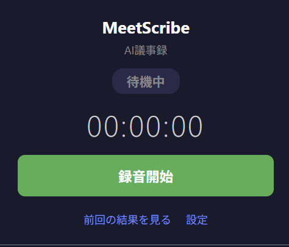
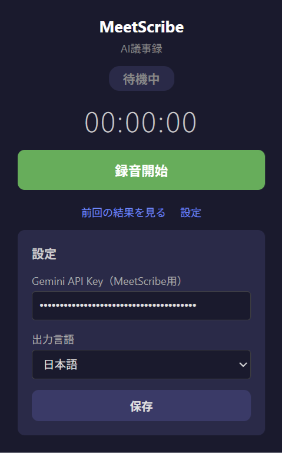
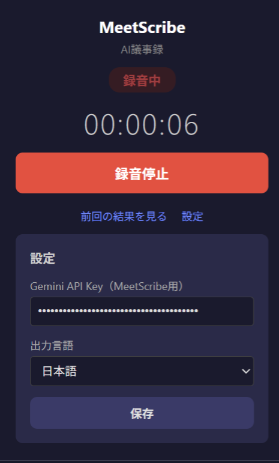

# MeetScribe - AI議事録 Chrome拡張

**自分が主催していない会議やウェビナーでも、ワンクリックで議事録を残せる Google Workspace 支援アプリ**



## 課題

Google Meet の録画・文字起こし機能は**主催者（ホスト）にしか使えません。**

- 参加者として出たウェビナーの内容をメモし忘れた
- 他社主催の会議で議事録を取る余裕がなかった
- Zoom / Teams（ブラウザ版）の会議も同じように記録したい

これらのケースでは、会議が終わった後に振り返る手段がありません。

## 解決策

MeetScribe は **Chrome のタブ音声をキャプチャ** し、**Gemini API で文字起こし + 要約** を自動生成します。

- 主催者の権限は一切不要
- Google Meet / Zoom / Teams（ブラウザ版）すべて対応
- 録音中も会議の音声はそのまま聞こえる
- 生成された議事録は Google Workspace と同じ場所で管理可能

## 使い方

### 1. 設定

拡張アイコンをクリック → 「設定」→ Gemini API Key を入力して保存



### 2. 録音

会議中に拡張アイコンをクリック → 「録音開始」



### 3. 結果

録音停止後、AIが自動で以下を生成:

- **文字起こし全文**（話者区別 + タイムスタンプ付き）
- **構造化された要約**
  - 概要
  - 議論ポイント
  - 決定事項
  - アクションアイテム（担当者・期限付き）

ワンクリックで Markdown 形式にコピーし、Google ドキュメントや Google Drive に保存できます。

## コスト

Gemini 2.0 Flash API 料金に基づく試算（2026年2月時点）

> **1分あたり約0.2円** — 1時間の会議でも約12円

| 項目 | 料金レート | 1分あたり | 1時間の会議 | 月20回利用 |
|---|---|---|---|---|
| 音声文字起こし | $0.70 / 1Mトークン | 約0.2円 | 約12円 | 約240円 |
| 要約生成（テキスト） | $0.10 / 1Mトークン | — | ほぼ無料 | ほぼ無料 |
| **合計** | | **約0.2円/分** | **約12円** | **約240円/月** |

※ 1USD = 150円で換算。音声は1秒あたり約32トークンで計算。

## セットアップ

```bash
# ビルド
cd MeetScribe
npm install
npm run build

# Chrome に読み込み
# 1. chrome://extensions/ を開く
# 2. 「開発者モード」ON
# 3. 「パッケージ化されていない拡張機能を読み込む」→ dist フォルダを選択
```

## 技術スタック

- Chrome Extension Manifest V3
- TypeScript + Webpack
- Gemini 2.0 Flash API（文字起こし + 要約の2フェーズ処理）
- chrome.tabCapture API + MediaRecorder + AudioContext

## 制約事項

- ブラウザ版の会議ツールのみ対応（デスクトップアプリ版は非対応）
- 録音開始にはユーザーのクリックが必須（ブラウザセキュリティ要件）
- 1回の録音は20MB以下（約2時間相当）
